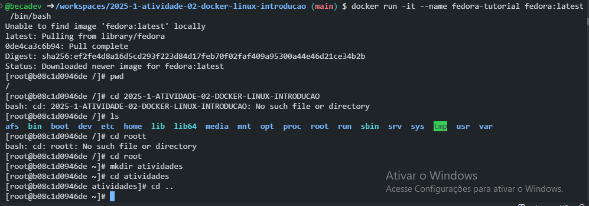
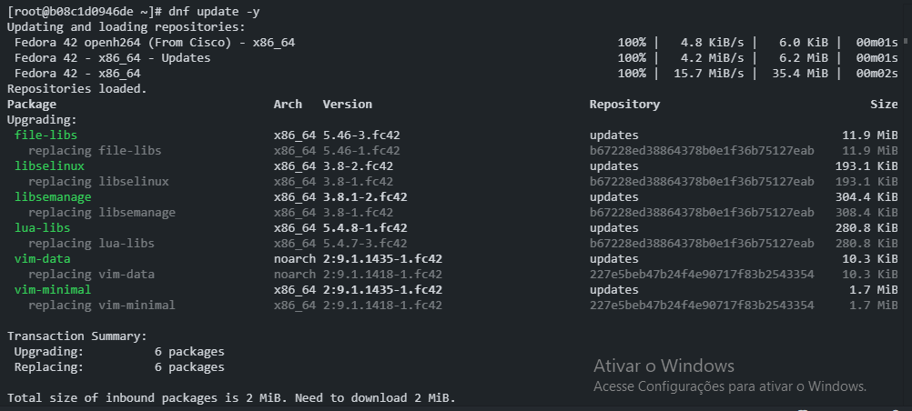
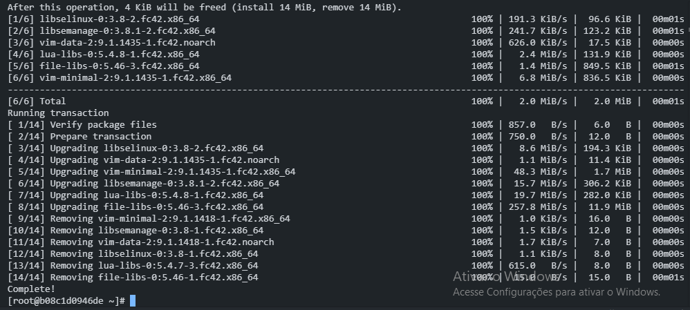
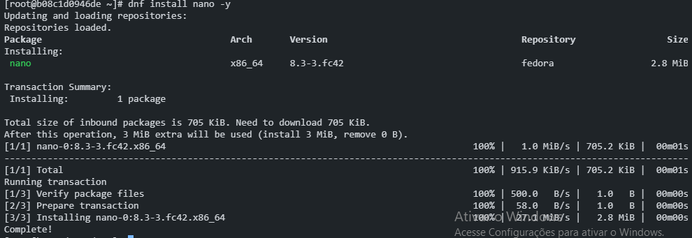
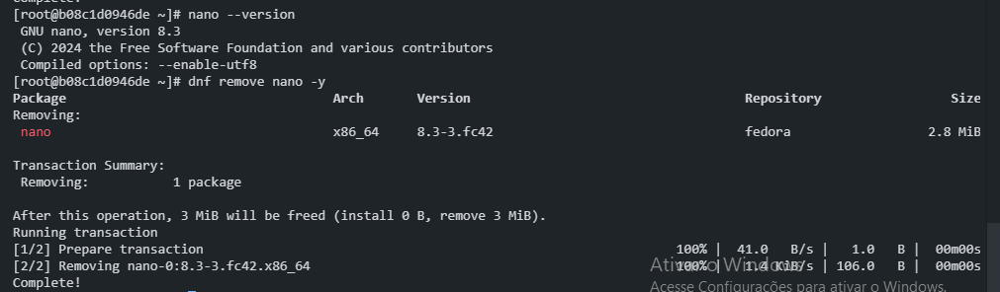
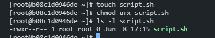
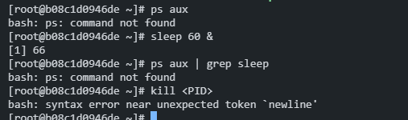
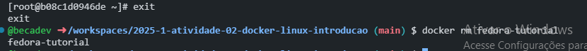

# S.O. 2025.1 - Atividade 02 - Introdução a linux usando docker no windows
### Nome: Rebeca Noemi Silva Ferreira
### Data: 02/05/2025

## Introdução:
O Objetivo dessa atividade é abordar fundamentos linux, sua estrutura básica, comando essenciais e conceitos.

## 1. Navegação Básica:
- Foi realizado comandos báscios para poder aprender a transitar pelos diretórios linux, criar diretórios e excluir-los.

## 2. Gerenciamento de pacotes:
- Foi realizado comandos para gerencias pacotes, criar, instalar uma ferramenta nano, verificar a versão dela e excluir.

## 3.Permissões de arquivos:
- Foi realizado comandos para fazer modificações nas permissões de arquivos

## 4.Processos em execução:
- Execução de comandos para monitorar e encerrar processos no linux.
- Dificuldade: não entendi se o resultado era para ser esse, acredito que devido estar usando codespace por questões de limitações na minha máquina, o resultado ocorreu diferente.

## 5.Encerrando o contêiner:
- Comandos para encerrrar o container e removê-lo.

## O que aprendi e as dificuldades:
- Aprendi comandos básicos e essenciais do linux;
- Minha dificuldade foi em relação a ter que realizar os passos no codespace devido a limitação da minha máquina, acredito que, o resultado ocorreu de forma diferente do que teria ocorrido em uma máquina local.

